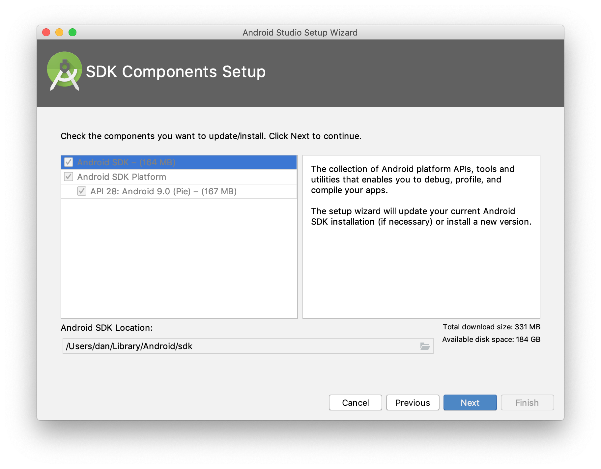
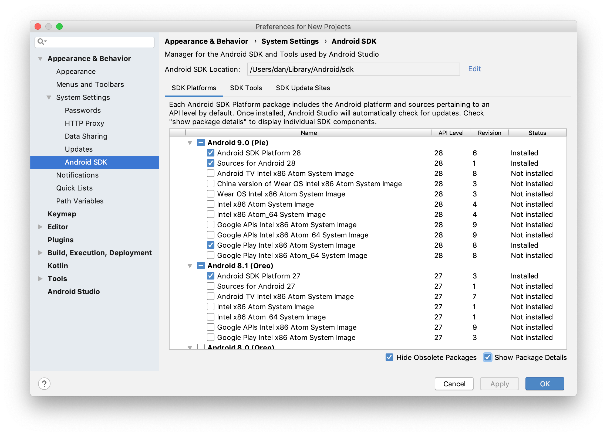

# Installation

## Software and tools reqiured
| Software                               | Version  | Instructions |
|----------------------------------------------|------------------------|--------|
| [NodeJS](https://nodejs.org/en/) | 10.16.3 LTS | - |
| [npm](https://www.npmjs.com/) | 6.4.1 | (Should be bundled with NodeJS) |
| [Java JDK8](https://www.oracle.com/technetwork/java/javase/downloads/jdk8-downloads-2133151.html) | Java 8 | - |
| [Gradle](https://gradle.org/)| Latest |[Gradle Instructions](https://gradle.org/install/) |
| [Android Studio](https://developer.android.com/studio/) | Latest |[Android Studio Intructions](https://developer.android.com/studio/install)|

## Installing the Android SDK
Once installed, open Android Studio. The IDE should detect that the Android SDK needs to be installed. In the SDK Components Setup screen, finish installing the SDK. Keep note of the Android SDK Location.

Android Studio SDK Setup

By default, the latest stable SDK Platform is installed, which includes a collection of packages required to target that version of Android.

To install system images and other minor SDK platform packages, you may need to ensure Show Package Details is checked at the bottom of the SDK Manager.Android Studio SDK Manager

Android SDK can be managed with Android Studio in the Configure » SDK Manager menu of the Android Studio welcome screen or Tools » SDK Manager inside Android projects.

Our projects minimum android API level is 19(Kitkat) and everything up till API level 28(Pie) should work and has been tested with, theoratically, any API level higher than 28 should work, but we have not tested it.

## Configuring Command Line Tools
Before they can be used, some environment variables must be set. The following instructions are for Windows and MacOS. [Setting paths](https://www.dev2qa.com/how-to-set-android-sdk-path-in-windows-and-mac/)