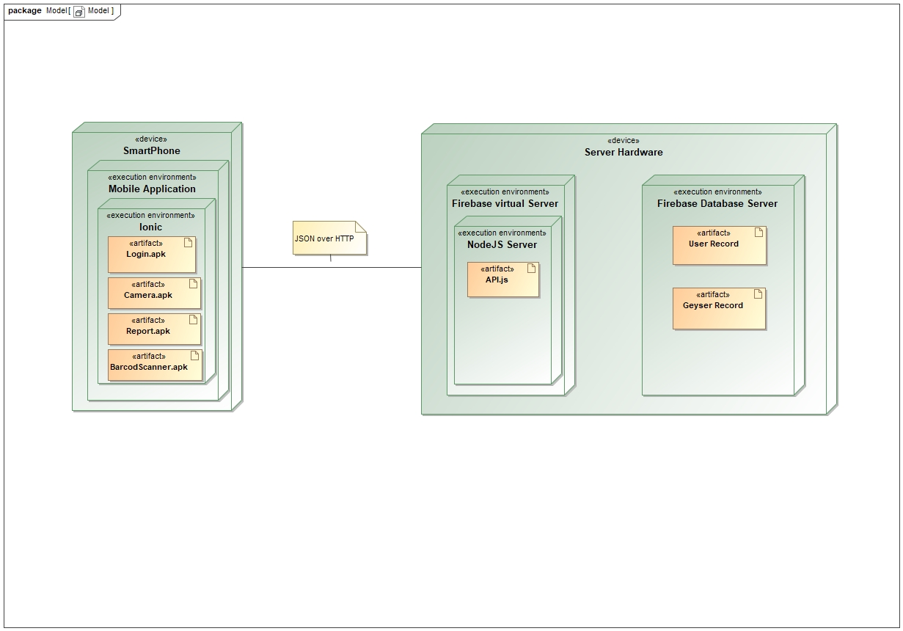
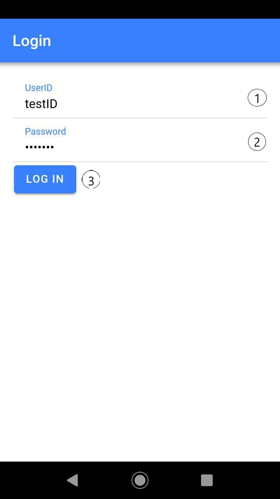
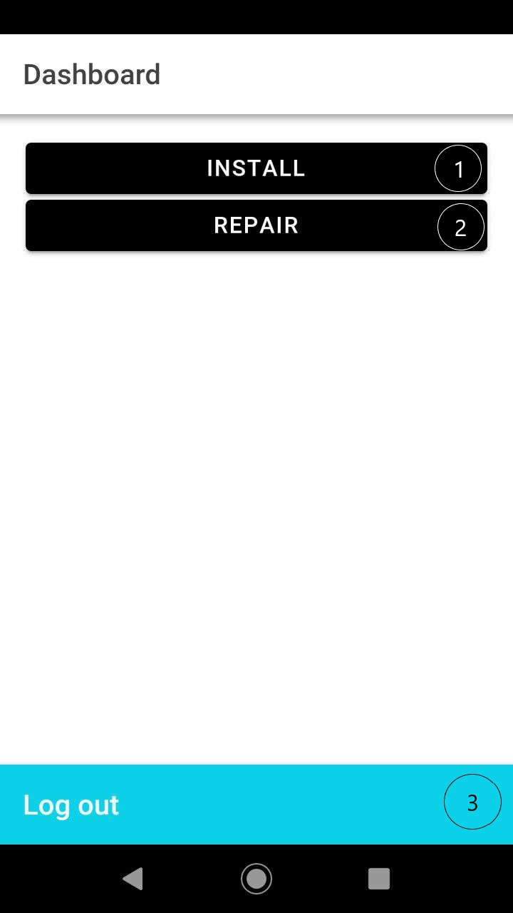
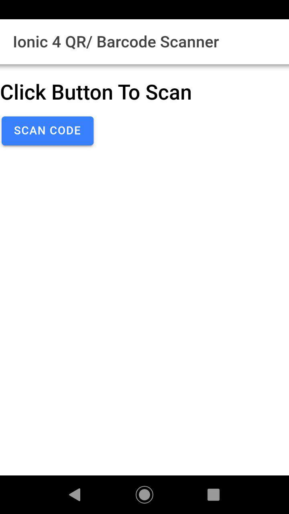
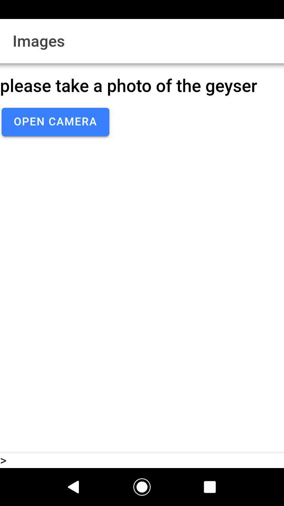
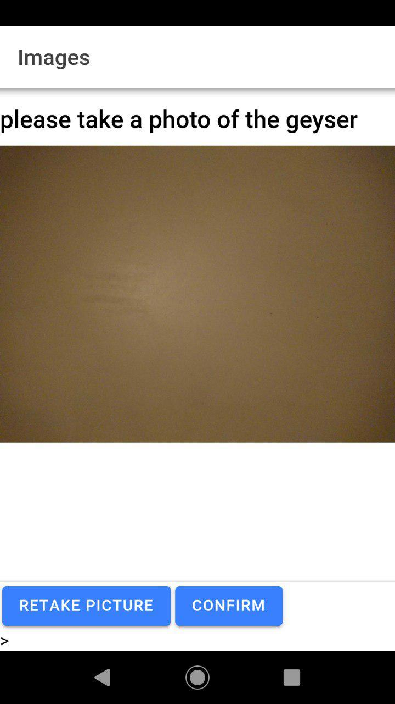
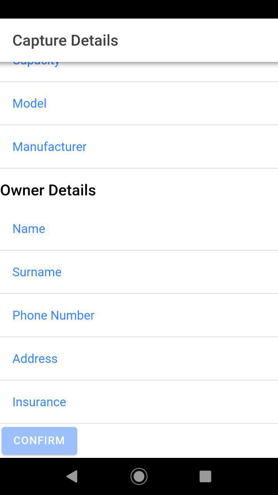

    <h1 align="center"> Geyser App </h1>
    <h1 align="center"> User Manual (Demo 2) </h1>
    <h2 align="center"> Vinesh Naidu - Client </h2>
    <h2 align="center"> Developers </h2>
    <h3 align="center"> Theoveshan Naidu </h3>
    <h3 align="center"> Alexandros Petrou </h3>
    <h3 align="center"> Janaki Patil </h3>
    <h3 align="center"> Tristan Sander-hughes </h3>
    <h3 align="center"> Zi Xin Zhang </h3>

<h2>System Overview</h2>
Summary:
Information about the geyser and its installation, including relevant documents, are recorded and kept on a database in order to ease the installation process.

Plumbers:
The app intends to help the user through any documentation a they might do for a geyser installation/repair.

Homeowners:
The app intends to provide a way for users to access information about their registered geyser(s).

Administrators:
User data is stored online in a remote, secure database for any queries that the admin requires data for.

<h2>System Configuration</h2>

This app works on all mobile devices running an Android Operating System, minimum version Oreo. The app communicates with the database on two occasions, one for a login process and once more when either retrieving or sending records from the database for an installation/repair or a data query. The application requires any internet connection to work.

<h2>Installation</h2>

This software is provided by the administrator. The APK for installation can be found on our project Github page under the "Build" folder. To install simply run the apk on the device and when prompted whether sure or not press "install anyways".

<h2>Getting Started</h2>

In order to get a license one must consult an administrator for them to create an account for you. Once this is done input your userID and password into the fields on the main screen in order to log in. As of the current version there is no way to change userID or password other than to contact the administrator and request a change. 

A typical walkthrough of the app: 
Login using userID and password[1]. Select Installation and scan the barcode as per the onscreen prompt[2]. Press on "Open Camera" to open the camera and take a picture of the appropriate component as per the prompt on the screen[3]. This repeats for 4 more cycles. The user can choose to retake a photo if they wish to[4]. Finally input all appropriate details into the form and confirm the details[5], all fields are required.

To exit the application, use the phone's back function until you return to the "Dashboard" then press "Logout"[6].

<h3>Deployment Model</h3>

<h2>Using the System</h2>

<h3>[1]Logging in</h3>

This is the login screen and also the first screen you see upon opening the application.
1. This field is where you input your userID.
2. This field is where you input your password.
3. Press this button once both fields have been filled to login.
A password is necessary as otherwise unauthorized users would have access to information and we wouldn't be able to accurately retrieve/send data to your own corresponding records.

<h3>Dashboard</h3>

This is the Dashboard where the user selects what actions to perform.
1. Press this button in order to specify that the user is performing an installation. This is important as installations and the recording of relevant information is a core function of this application.
2. This function has not been implemented yet.
3. [6] Press this to logout and return to the login screen.

<h3>Barcode</h3>

There is only one pressable button here and it is the "Scan code" button[2]. Press this button to open the barcode scanner and place the barcode within the field to scan it. This identifies the geyser that the user will be working on.

<h3>Camera</h3>

This screen prompts the user to take pictures of the corresponding geyser part. Pressing the "Open Camera" button will open the camera to take a picture[3]. Once a picture has been taken the user will be given a preview of the picture and the option to retake the picture using the "Retake picture" option[4] depicted below. If the user is satisfied with the picture they can press the "Confirm" button to proceed to the next image.

Images are required in order to ensure placement of the correct components for future insurance purposes.

<h3>[5]Details</h3>

All details from top to bottom: Capacity, Model, Manufacturer, Name, Surname, Phone Number, Address, Insurance
All fields must be filled out and are required in order to be able to press the "Confirm" button and send the details to the database. This is especially important as this is the step where the data is sent to the database. The actual sending only happens after pressing "Confirm".

<h2>Troubleshooting</h2>

Error messages will appear if required fields that need to be filled in have been left blank. In this instance an error message in red will appear underneath the required field. This occurs on the login page and on the details page. This can be avoided by filling in the required fields.